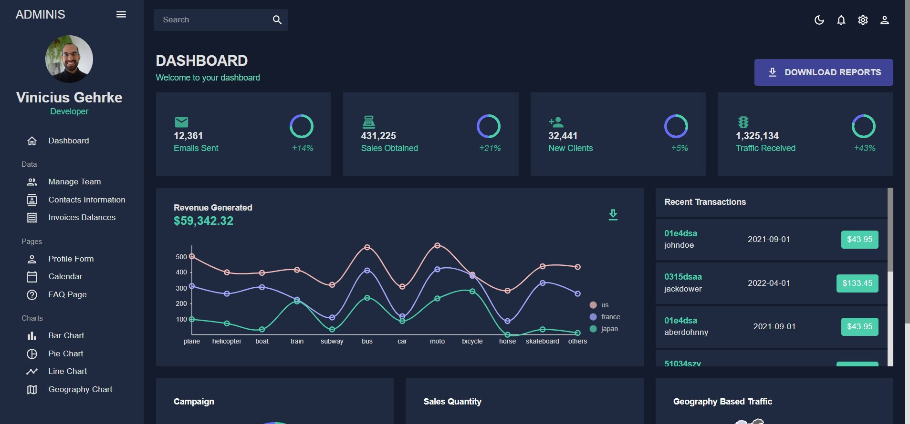

# Game Dashboard



Dashboard using React 18, Material-UI, Nivo Charts, FullCalendar, Formik and Yup.

## What is inside?

This project uses many tools like:

- [Vite](https://vitejs.dev)
- [ReactJS](https://reactjs.org)
- [TypeScript](https://www.typescriptlang.org)
- [Material-UI](https://mui.com)
- [Nivo Charts](https://nivo.rocks)
- [FullCalendar](https://fullcalendar.io)
- [Formik](https://formik.org)
- [Yup](https://github.com/jquense/yup)
- [Eslint](https://eslint.org)
- [Prettier](https://prettier.io)

## Getting Started

For this project I used Node.js v16.10.0 and PNPM v7.26.2

### Install

Clone this project

```bash
git clone https://github.com/ViniciusLagoGehrke/Game-Dashboard.git
```

Access the project directory.

```bash
cd Game-Dashboard
```

Install dependencies. (I suggest using PNPM)

```bash
pnpm install
```

Serve with hot reload at <http://localhost:5173>.

```bash
pnpm run dev
```

### Lint

```bash
pnpm run lint
```

### Typecheck

```bash
pnpm run typecheck
```

### Build

```bash
pnpm run build
```

### Test

```bash
pnpm run test
```

View and interact with your tests via UI. (Awesone vitest feature!)

```bash
pnpm run test:ui
```

## Deployment

I deployed this project in Vercel where you can Log in with GitHub, GitLab, Bitbucket, or email to deploy websites for free with zero configuration, automatic SSL, and global CDN.

You can check it live here: [Game Dashboard](https://game-dashboard-nine.vercel.app/)

[OnPortfolio](https://front-end-portfolio.vercel.app/)
